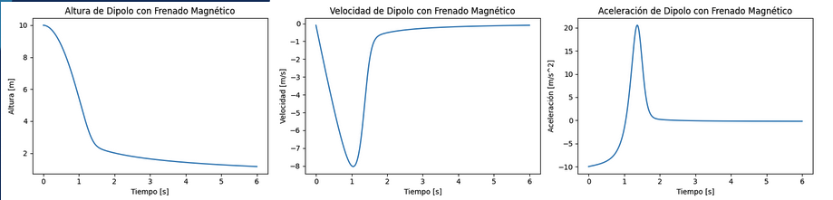
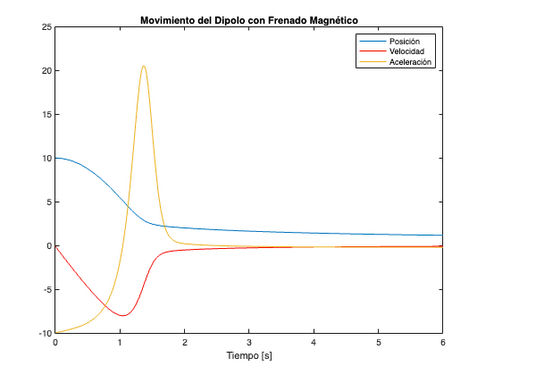

# F1014B
## Modelación de Sistemas Electromanéticos
### Integrantes: 
- Andrés Martínez - A00227463
- Andrés Sandoval - A01253138
- Jesús Medina - A01254620
- Daniel Fernández - A01254659
- Francisco Rochín - A01252974

## Situación Problema: 
Crear una simulación computacional de la desaceleración por frenado magnético (corrientes de Eddy) de una góndola en una torre de caída de un parque de diversiones.

### Simulación (Resultado Final) 

### Notas Finales
- La versión de Python solo fue usada por propósitos de prototipado y, aunque se encuentre en un estado funcional, no es la versión final del proyecto.